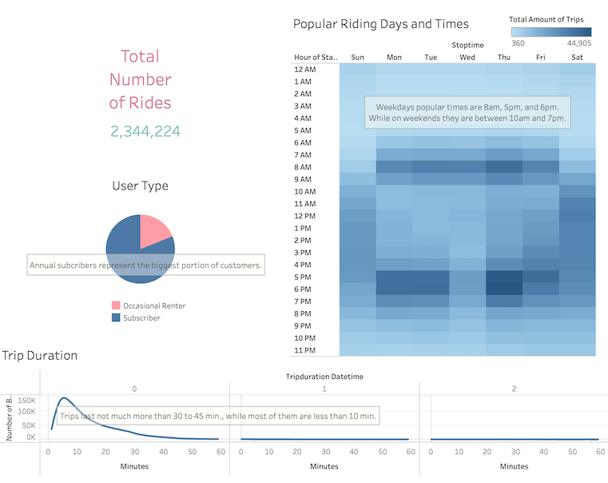
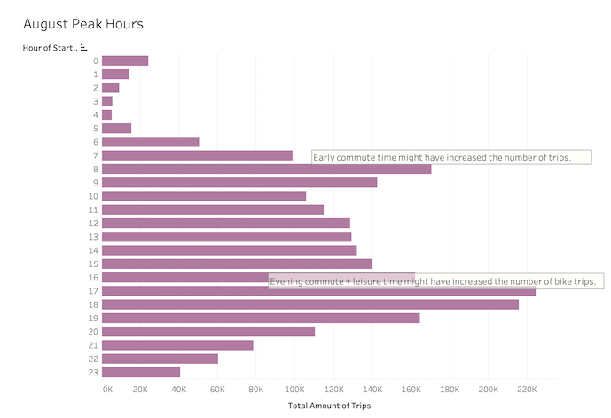
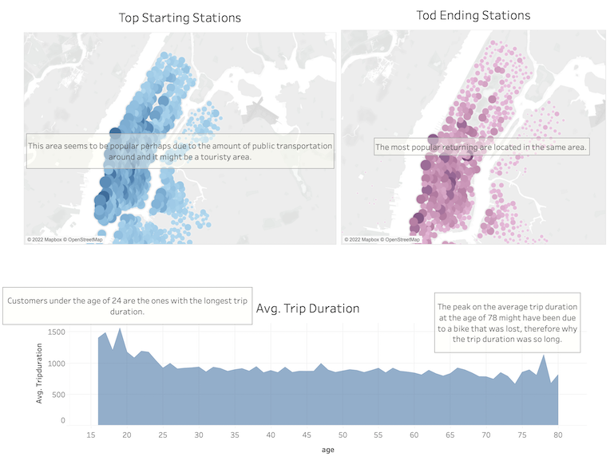
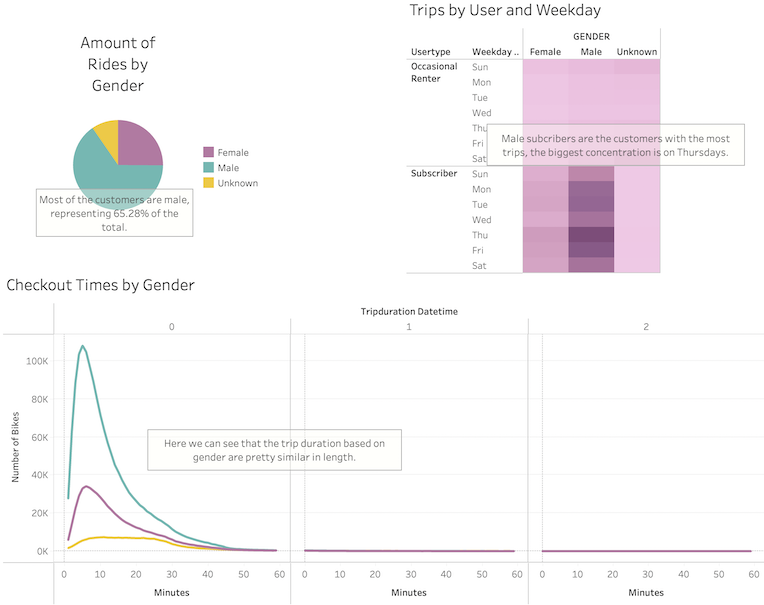
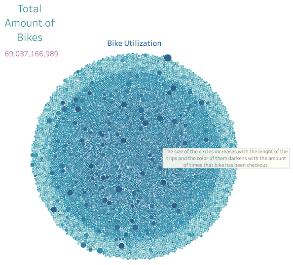

# Bike_Sharing
Creating visualizations using Tableau in order to analyze New York bike sharing data.

## Project Overview 

The purpose of this project is to analyze New York City's citybike, to get results that might be useful for analyzing the viability of opening a bike-share system in Des Moines, Iowa. 

# Design Solution

- Import data into Tableau;
- Create and style worksheets, dashboards, and stories using Tableau;
- Use Tableau worksheets to display data;
- Portray data accurately using Tableau dashboards.

## Results 

Tableau Book with charts, dashboards, and story can be found here:
https://public.tableau.com/app/profile/bianca.taise.pommerening/viz/Challenge14-TableauBook/Story1?publish=yes

### Overall Summary of Trips and Customers

- Total Number of Rides: 2,344.224
- User data types were modified from number to percentages:
    - Occasional Renters: 81.07%
    - Subscribers: 18.93%
- Popular Riding Days and Times: 
    - Weekdays popular times are 8am, 5pm, and 6pm. On weekends, 10am and 7pm seem to be the most popular ones.
- Trip Duration:
    - Trips last not much more than 30 to 45 minutes, while most of them are less than 10 min.

### Popular Riding Times

- August Peak Hours:
    - Early commute time might have increased the number of trips.
    - Evening commute and leisure time might have increased the number of bike trips.

### Popular Stations and Average Trip Duration by Age

- Popular Starting and Ending Points 
    - The most popular starting points are concentrated on the same part of Manhattan, which might be due to the amount of public transportation in the area. Another factor that could be contributing is that the area might be touristy.
    - Top ending stations are located in the same area.

- Average Trip Duration Chart:
    - After analyzing the birthdates of the renters, it could be seen that there was a significant number of renters age 80 to 132. They were most likely typos on the dataset, where for example instead of typing 1990, it was typed 1890, so it was decided that the data would be filtered to show results for renters up to 80 years old and that there was still enough data left for a proper analysis.
    - To improve the readability of the chart, birth dates were converted to display the ages instead.
    - The peak at the age of 78 might have been due to a bike that was lost/stolen, therefore why the average trip duration was so long.
    - Customers under the age of 24 were the ones with the longest average trip duration. 

### Analysis Based on Gender

- Amount of rides by Gender:
    - Most of the customers are male, representing 65.28% of the total.

- Trips by User and Weekday
    - Male subscribers are the customers with the most trips, and the biggest concentration of rides are on Thursdays.

- Checkout Times by Gender:
    - The length of the trips are pretty similar among all genders.

### Total Bikes and Bike Utilization

- Bike Utilization: 
    - The size of the circle increases with the length of the trips, and the color darkens with the amount of times the bike has been checked out.

## Summary

The bikes are used mostly for short trips and during commute times around the same area of Manhattan, where most customers are male annual subscribers.

### Additional Visualization Suggestions

- In order to help to analyze the viability of opening a bike-share system in Des Moines, Iowa, additional data should be collected and extra charts should be plotted:
    - Collect data around different seasons.
        - Plot peak hours, weekdays, and popular start and end stations for the other seasons.
    - Collect data about the miles that each bike id has run.
        - Plot a bike repair graph, based on miles, trip duration, and number of trips, to better define costs, rate, and which bikes need repair.

